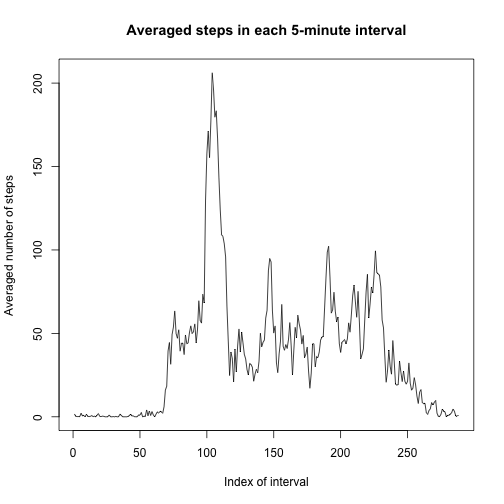

## Loading and preprocessing the data


```r
setwd("~/Desktop/Data Sciences Specialization/Reproducible Research/RepRes_PeerAssessment1")
activity <- read.csv("activity.csv", stringsAsFactors=FALSE)
```

## What is mean total number of steps taken per day?

1. Calculate the total number of steps taken per day

```r
ans1 <- tapply(activity$steps, activity$date, sum)
ans1
```

```
## 2012-10-01 2012-10-02 2012-10-03 2012-10-04 2012-10-05 2012-10-06 
##         NA        126      11352      12116      13294      15420 
## 2012-10-07 2012-10-08 2012-10-09 2012-10-10 2012-10-11 2012-10-12 
##      11015         NA      12811       9900      10304      17382 
## 2012-10-13 2012-10-14 2012-10-15 2012-10-16 2012-10-17 2012-10-18 
##      12426      15098      10139      15084      13452      10056 
## 2012-10-19 2012-10-20 2012-10-21 2012-10-22 2012-10-23 2012-10-24 
##      11829      10395       8821      13460       8918       8355 
## 2012-10-25 2012-10-26 2012-10-27 2012-10-28 2012-10-29 2012-10-30 
##       2492       6778      10119      11458       5018       9819 
## 2012-10-31 2012-11-01 2012-11-02 2012-11-03 2012-11-04 2012-11-05 
##      15414         NA      10600      10571         NA      10439 
## 2012-11-06 2012-11-07 2012-11-08 2012-11-09 2012-11-10 2012-11-11 
##       8334      12883       3219         NA         NA      12608 
## 2012-11-12 2012-11-13 2012-11-14 2012-11-15 2012-11-16 2012-11-17 
##      10765       7336         NA         41       5441      14339 
## 2012-11-18 2012-11-19 2012-11-20 2012-11-21 2012-11-22 2012-11-23 
##      15110       8841       4472      12787      20427      21194 
## 2012-11-24 2012-11-25 2012-11-26 2012-11-27 2012-11-28 2012-11-29 
##      14478      11834      11162      13646      10183       7047 
## 2012-11-30 
##         NA
```
2. Make a histogram of the total number of steps taken each day

```r
par(mar = c(4, 4, 2, 2))
hist(ans1)
```

 
3. Calculate and report the mean and median of the total number of steps taken per day

```r
c(mean = mean(ans1, na.rm=TRUE), median = median(ans1, na.rm=TRUE))
```

```
##     mean   median 
## 10766.19 10765.00
```

## What is the average daily activity pattern?

1. Make a time series plot (i.e. type = "l") of the 5-minute interval (x-axis) and the average number of steps taken, averaged across all days (y-axis)

```r
ans2 <- tapply(activity$steps, activity$interval, function(x) mean(x, na.rm=TRUE))
plot(ans2, type="l")
```

 
2. Which 5-minute interval, on average across all the days in the dataset, contains the maximum number of steps?

```r
as.numeric(which(ans2 == max(ans2)))
```

```
## [1] 104
```

```r
ans2[which(ans2 == max(ans2))]
```

```
##      835 
## 206.1698
```

## Imputing missing values

Note that there are a number of days/intervals where there are missing values (coded as NA). The presence of missing days may introduce bias into some calculations or summaries of the data.
1. Calculate and report the total number of missing values in the dataset (i.e. the total number of rows with NAs)

```r
dim(activity[is.na(activity$steps),])[1]
```

```
## [1] 2304
```
2. The mean of each 5-minute interval is used to fill in all of the missing values in the dataset. 
3. A new dataset is created which contains the same original dataset but with the missing data filled in.

```r
activity2 <- activity
activity2[is.na(activity2$steps),]$steps <- ans2
head(activity2)
```

```
##       steps       date interval
## 1 1.7169811 2012-10-01        0
## 2 0.3396226 2012-10-01        5
## 3 0.1320755 2012-10-01       10
## 4 0.1509434 2012-10-01       15
## 5 0.0754717 2012-10-01       20
## 6 2.0943396 2012-10-01       25
```

```r
# Can the code be improved?
```
4. Make a histogram of the total number of steps taken each day and calculate and report the mean and median total number of steps taken per day. Do these values differ from the estimates from the first part of the assignment? What is the impact of imputing missing data on the estimates of the total daily number of steps?

```r
ans3 <- tapply(activity2$steps, activity2$date, sum)
hist(ans3)
```

 

```r
c(mean = mean(ans3), median = median(ans3))
```

```
##     mean   median 
## 10766.19 10766.19
```
Imputing missing data did not change the mean, but the median was changed.

## Are there differences in activity patterns between weekdays and weekends?

1. A new factor variable was added to the dataset, indicating whether a given date is a weekday or weekend day.

```r
library(dplyr)
```

```
## 
## Attaching package: 'dplyr'
## 
## The following objects are masked from 'package:stats':
## 
##     filter, lag
## 
## The following objects are masked from 'package:base':
## 
##     intersect, setdiff, setequal, union
```

```r
activity2$date <- as.Date(activity2$date)
activity2 <- mutate(activity2, daytype = factor(1 * (weekdays(date) == "Saturday" | weekdays(date) == "Sunday"), labels = c("weekday", "weekend")))
```
2. Make a panel plot containing a time series plot of the 5-minute interval (x-axis) and the average number of steps taken, averaged across all weekday days or weekend days (y-axis). See the README file in the GitHub repository to see an example of what this plot should look like using simulated data.

```r
weekday <- split(activity2, activity2$daytype)[[1]]
weekend <- split(activity2, activity2$daytype)[[2]]
weekday.avg <- tapply(weekday$steps, weekday$interval, mean)
weekend.avg <- tapply(weekend$steps, weekend$interval, mean)
plot(weekday.avg, type="l", col = "red")
lines(weekend.avg, col = "blue")
```

 

```r
# add a legend, showing red as weekday, blue as weekend
```
