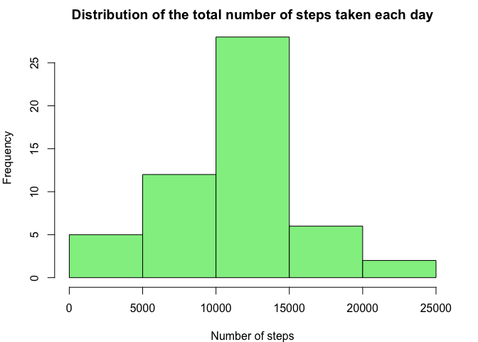

# Reproducible Research: Peer Assessment 1
Yukai Zou  
11 November 2015  

## Loading and preprocessing the data

We began with setting the working directory and loading the data:

```r
setwd("~/Desktop/Data Sciences Specialization/Reproducible Research/RepData_PeerAssessment1/")
activity <- read.csv("activity.csv", stringsAsFactors=FALSE)
head(activity)
```

```
##   steps       date interval
## 1    NA 2012-10-01        0
## 2    NA 2012-10-01        5
## 3    NA 2012-10-01       10
## 4    NA 2012-10-01       15
## 5    NA 2012-10-01       20
## 6    NA 2012-10-01       25
```


## What is mean total number of steps taken per day?

To answer the question, first we calculated the total number of steps taken per day:

```r
ans1 <- tapply(activity$steps, activity$date, sum)
ans1
```

```
## 2012-10-01 2012-10-02 2012-10-03 2012-10-04 2012-10-05 2012-10-06 
##         NA        126      11352      12116      13294      15420 
## 2012-10-07 2012-10-08 2012-10-09 2012-10-10 2012-10-11 2012-10-12 
##      11015         NA      12811       9900      10304      17382 
## 2012-10-13 2012-10-14 2012-10-15 2012-10-16 2012-10-17 2012-10-18 
##      12426      15098      10139      15084      13452      10056 
## 2012-10-19 2012-10-20 2012-10-21 2012-10-22 2012-10-23 2012-10-24 
##      11829      10395       8821      13460       8918       8355 
## 2012-10-25 2012-10-26 2012-10-27 2012-10-28 2012-10-29 2012-10-30 
##       2492       6778      10119      11458       5018       9819 
## 2012-10-31 2012-11-01 2012-11-02 2012-11-03 2012-11-04 2012-11-05 
##      15414         NA      10600      10571         NA      10439 
## 2012-11-06 2012-11-07 2012-11-08 2012-11-09 2012-11-10 2012-11-11 
##       8334      12883       3219         NA         NA      12608 
## 2012-11-12 2012-11-13 2012-11-14 2012-11-15 2012-11-16 2012-11-17 
##      10765       7336         NA         41       5441      14339 
## 2012-11-18 2012-11-19 2012-11-20 2012-11-21 2012-11-22 2012-11-23 
##      15110       8841       4472      12787      20427      21194 
## 2012-11-24 2012-11-25 2012-11-26 2012-11-27 2012-11-28 2012-11-29 
##      14478      11834      11162      13646      10183       7047 
## 2012-11-30 
##         NA
```
We then made a histogram to observe the distribution:

```r
par(mar = c(4, 4, 2, 2))
hist(ans1, main = "Distribution of the total number of steps taken each day", 
     xlab = "Number of steps", col = "lightgreen")
```

 

The distribution is somewhat skewed to the left, but seems that the majority lies between 10000 and 15000. We then calculated the mean and median of the total number of steps taken per day:

```r
c(mean = mean(ans1, na.rm=TRUE), median = median(ans1, na.rm=TRUE))
```

```
##     mean   median 
## 10766.19 10765.00
```
The median is slightly lower than the mean value.


## What is the average daily activity pattern?

To answer this question, we first averaged the number of steps, ignoring all the missing values, within each interval; then we plotted a time-series line graph with the 5-minute interval as x axis and the averaged number as y-axis.

```r
ans2 <- tapply(activity$steps, activity$interval, function(x) mean(x, na.rm=TRUE))
plot(ans2, type="l", xlab = "Index of interval", ylab = "Averaged number of steps",
     main = "Averaged steps in each 5-minute interval")
```

 

Based on the time-series plot, a peak was identified around the 100th interval. We then applied `which()` to find which index the peak value corresponds to:

```r
c(interval = names(which(ans2 == max(ans2))), index = as.numeric(which(ans2 == max(ans2))))
```

```
## interval    index 
##    "835"    "104"
```
Therefore, we found that on average across all the days, the maximum number of steps was recorded at the **104th** interval, from **835** to **840 minutes**.

## Imputing missing values

We suspected that the presence of missing values (e.g. missing days/intervals, indicated by `NA`) may introduce bias in our calculations and summaries, therefore, it is necessary to impute these missing values. First, we wanted to know how many missing values in total are there within the dataset:

```r
missing <- is.na(activity$steps)
sum(missing)
```

```
## [1] 2304
```
That's quite a few. To impute the missing data, the mean of each 5-minute interval was used to fill in all of the missing values in the dataset, and a new dataset was created which contains the same original dataset but with the missing data filled in:

```r
activity2 <- activity
interval <- activity2[missing,]$interval
for (i in 1:length(interval)) {
        activity2[missing,]$steps[i] <- ans2[which(names(ans2) == interval[i])] 
        # impute the missing date with the corresbonding mean value
}
head(activity2)
```

```
##       steps       date interval
## 1 1.7169811 2012-10-01        0
## 2 0.3396226 2012-10-01        5
## 3 0.1320755 2012-10-01       10
## 4 0.1509434 2012-10-01       15
## 5 0.0754717 2012-10-01       20
## 6 2.0943396 2012-10-01       25
```
The imputation has done successfully. We then made a histogram to look at the new distribution of the total number of steps taken each day:

```r
ans3 <- tapply(activity2$steps, activity2$date, sum)
hist(ans3, main = "Distribution of the total number of steps taken each day", xlab = "Number of steps", 
     col = "lightblue")
```

 

The distribution, after imputing the missing data, looks less skewed and more concentrated around the mean. We then calculated the new mean and median of the total number of steps taken per day:

```r
c(mean = mean(ans3), median = median(ans3))
```

```
##     mean   median 
## 10766.19 10766.19
```
Compared with the previous numbers, imputing missing data did not alter the mean, and the median became identical with the mean.

## Are there differences in activity patterns between weekdays and weekends?

To compare the activity patterns between weekdays and weekends, a new factor variable was added to the dataset using *dplyr* package, indicating whether a given date is a weekday or weekend day.

```r
library(dplyr)
```

```
## 
## Attaching package: 'dplyr'
## 
## The following objects are masked from 'package:stats':
## 
##     filter, lag
## 
## The following objects are masked from 'package:base':
## 
##     intersect, setdiff, setequal, union
```

```r
activity2$date <- as.Date(activity2$date)
activity2 <- mutate(activity2, daytype = factor(1 * (weekdays(date) == "Saturday" | 
                     weekdays(date) == "Sunday"), labels = c("weekday", "weekend")))
```
We then made a line graph containing a time series plot of the 5-minute interval (x-axis) and the average number of steps taken (y-axis), averaged across all weekday days (red line) or weekend days (blue line). The two lines were overlayed to make the comparison more intuitive.

```r
weekday <- split(activity2, activity2$daytype)[[1]] # Subset the weekday days
weekend <- split(activity2, activity2$daytype)[[2]] # Subset the weekend days
weekday.avg <- tapply(weekday$steps, weekday$interval, mean) # Average across weekday days
weekend.avg <- tapply(weekend$steps, weekend$interval, mean) # Average across weekend days
plot(weekday.avg, type="l", col = "red", main = "Average number of steps by weekdays and weekends", 
     xlim = c(0,300), xlab = "Index of 5-minute interval", ylab = "Average number of steps")
lines(weekend.avg, col = "blue")
legend("topright", legend = c("weekdays", "weekends"), col = c("red", "blue"), lty = 1, cex = 1)
```

 

From the graph, we can see that there is not much difference in the first 50 intervals and after 250th interval between the two lines. At the first half of the day (from the 50th to around 130th interval), the average number of steps at weekdays is overall higher than that at weekends, whereas at the second half of the day (from the 130th to the 250th interval), the average number of steps was recorded with a relatively higher value at weekends.
